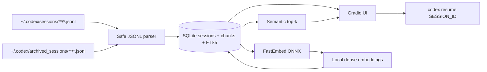

# Architecture

## Цель

Codex Context — read-only слой над локальной историей Codex CLI. Он не меняет rollout JSONL, не пытается подменить `codex resume` и хранит пользовательские названия отдельно.

## Data flow

1. Scanner рекурсивно читает активные и архивные `.jsonl`.
2. Parser извлекает `session_meta`, видимые user/assistant сообщения и полезные tool/command записи. Injected environment/AGENTS context не индексируется как пользовательский запрос.
3. Сессия получает стабильный `session_id`; при переносе файла в archive пользовательское название сохраняется.
4. Сообщения режутся на небольшие chunks и сохраняются в SQLite. FTS5 даёт дешёвый fallback.
5. FastEmbed строит dense embeddings локально через ONNX Runtime. По умолчанию используется multilingual MiniLM, потому что история смешивает русский, английский, имена файлов и код.
6. Поиск считает cosine similarity и отдаёт релевантный chunk вместе с названием сессии и Session ID.
7. UI показывает исходный conversation log и готовую команду `codex resume <id>`.

## Почему отдельная SQLite, а не правка Codex JSONL

Rollout-файлы являются внутренним состоянием Codex и могут иметь активного writer. Изменять их ради display title не нужно и рискованно. `custom_title` живёт только в `~/.local/share/codex-find-context/index.sqlite3`.

Parser терпим к последней незавершённой JSONL-строке: при чтении активной сессии она пропускается и попадёт в индекс после следующего refresh.

## Semantic model и fallback

Default: `sentence-transformers/paraphrase-multilingual-MiniLM-L12-v2` через FastEmbed. FastEmbed использует ONNX Runtime и не требует PyTorch/GPU. Модель скачивается один раз при первом semantic indexing, затем берётся из локального cache.

Если модель нельзя загрузить (нет сети на первом запуске, повреждён cache, несовместимость runtime), UI не падает: используется SQLite FTS5 и явно показывается `lexical fallback`.

## Incremental indexing

Для каждого rollout хранится `(path, mtime_ns, size_bytes)`. Неизменённые файлы повторно не парсятся. Изменившаяся активная сессия переиндексируется; embeddings пересчитываются только для её новых chunks.

## Privacy / security

- приложение слушает `127.0.0.1` по умолчанию;
- Codex JSONL только читаются;
- нет OpenAI API и внешнего LLM;
- локальная модель требует сеть только для первого скачивания весов;
- секреты и `.env` не коммитятся;
- web UI не выполняет пользовательский текст как shell-команду.

## Ограничения

Формат rollout JSONL — внутренний и может эволюционировать. Parser намеренно поддерживает несколько message/event shapes и безопасно игнорирует неизвестные типы. Если будущая версия Codex радикально изменит schema, browsing metadata продолжит работать, а extractor нужно будет расширить тестовым fixture из новой версии.
